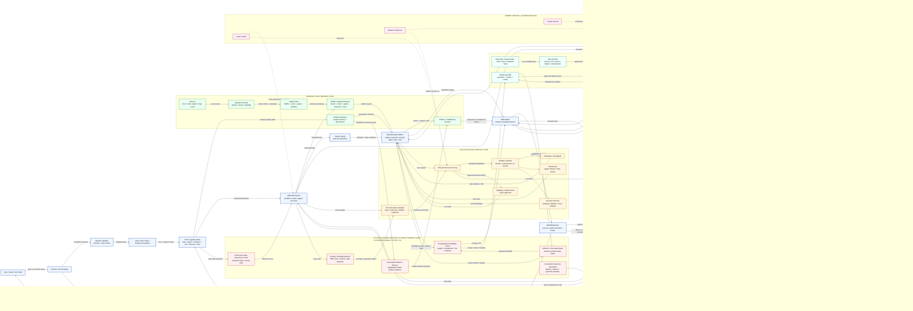

# Flowchart Schema

---

```mermaid
flowchart LR

%% =========================================================
%% AMALI LOGICAL FLOW SCHEMATIC — RADAR-LIKE SIGNAL CHAIN
%% =========================================================

%% ---------- MAIN INPUT / REQUEST CHAIN ----------
U["User / Owner / API Client"]
GW["Interface / API Gateway"]
REQ["Request Validator<br/>schema + auth context"]
CLS["Intent / Risk / Data / Evidence Classifiers"]
TCSL["TCSL Cognitive State<br/>task + agent + evidence + risk + memory + time"]
ROUTER["HER-MoE Router<br/>workflow / model / agent / tool route"]
PLAN["Planner Agent<br/>task decomposition"]
AGENTS["Specialist Agent Matrix<br/>coding / research / security / data / infra / critic"]
ARB["EWA Arbiter<br/>evidence-weighted decision"]
OUT["AMALIResponse<br/>success / partial / blocked / review"]

U -->|"task / command / query"| GW
GW -->|"normalized request"| REQ
REQ -->|"validated input"| CLS
CLS -->|"risk + evidence need"| TCSL
TCSL -->|"structured task state"| ROUTER
ROUTER -->|"RouteDecision"| PLAN
PLAN -->|"subtasks + stop conditions"| AGENTS
AGENTS -->|"candidate outputs"| ARB
ARB -->|"supported final result"| OUT
OUT -->|"answer / patch / report / rejection"| U


%% ---------- MODEL-TEAM SIGNAL CHAIN ----------
subgraph MODEL["MODEL-TEAM RUNTIME"]
  MG["Model Gateway<br/>local / hosted / vLLM / Ollama"]
  GEN["Generator Models<br/>plans / code / answers / data"]
  VER["Verifier Models<br/>correctness / tests / evidence"]
  SEC["Security Models<br/>prompt injection / tool abuse / leaks"]
  JEPA["JEPA-State Predictor<br/>expected next task state"]
  RERANK["Embedding + Reranker Models"]
end

ROUTER -->|"selected models"| MG
MG --> GEN
MG --> VER
MG --> SEC
MG --> JEPA
MG --> RERANK

GEN -->|"drafts / candidates"| AGENTS
VER -->|"verification signals"| ARB
SEC -->|"security findings"| ARB
JEPA -->|"expected state / deviation"| TCSL
RERANK -->|"ranked evidence"| ARB


%% ---------- EVIDENCE / RAG / MEMORY CHAIN ----------
subgraph EVIDENCE["EVIDENCE / RAG / MEMORY CHAIN"]
  SRC["Sources<br/>docs / code / papers / logs / evals"]
  INGEST["Ingestion Firewall<br/>sanitize / chunk / metadata"]
  IDX["Hybrid Index<br/>BM25 + vector + graph + symbols"]
  HSGR["HSGR / CGSHR Retrieval<br/>lexical + vector + graph + freshness + trust"]
  MEM["Evidence Memory<br/>project memory + provenance"]
  CITE["Citation + Faithfulness Checker"]
end

SRC -->|"raw sources"| INGEST
INGEST -->|"clean chunks + metadata"| IDX
IDX -->|"retrieval candidates"| HSGR
HSGR -->|"evidence pack"| AGENTS
MEM -->|"provenance memory"| AGENTS
AGENTS -->|"claims + evidence refs"| CITE
CITE -->|"supported / unsupported claims"| ARB
ROUTER -->|"retrieval policy"| HSGR
TCSL -->|"memory lookup state"| MEM


%% ---------- TOOL EXECUTION CHAIN ----------
subgraph TOOLS["TOOL EXECUTION CONTROL PLANE"]
  TPC["Tool Permission Compiler<br/>deny / read-only / sandbox / approval"]
  PROXY["Policy-Enforced Tool Proxy"]
  FS["Filesystem / Git Adapter"]
  TEST["Test Runner<br/>pytest / Maven / static checks"]
  SAST["Security Scanners<br/>Semgrep / Gitleaks / Trivy / CodeQL"]
  DB["Database / External APIs<br/>only if approved"]
  SANDBOX["Sandbox Runtime<br/>Docker / restricted FS / no secrets"]
end

ROUTER -->|"tool envelope"| TPC
AGENTS -->|"tool request"| PROXY
TPC -->|"permission decision"| PROXY
PROXY -->|"sandboxed read/write"| SANDBOX
SANDBOX --> FS
SANDBOX --> TEST
SANDBOX --> SAST
PROXY -->|"approved external action"| DB

FS -->|"repo evidence / diff"| AGENTS
TEST -->|"test result"| AGENTS
SAST -->|"security findings"| AGENTS
DB -->|"tool result"| AGENTS


%% ---------- PHYSICS-INSPIRED R&D / INTEGRITY LAYER ----------
subgraph PHYS["PHYSICS-INSPIRED INTEGRITY & STATE-DYNAMICS LAYER<br/>controlled R&D adapter, not MVP core"]
  EBM["Energy-Based Candidate Scorer<br/>quality / contradiction / risk / evidence"]
  AEM["Associative Evidence Memory<br/>Hopfield-like stable evidence patterns"]
  REPAIR["Diffusion / Flow Data Repair<br/>iterative synthetic-data repair"]
  DENS["Density / Anomaly Detector<br/>OOD route / memory / data detection"]
  PIM["Continuous State Dynamics for PIM<br/>expected state vs actual state"]
  CONST["Constraint-Preserving Specialists<br/>physics / robotics / geometry domains"]
end

TCSL -->|"task-state snapshot"| PIM
PIM -->|"deviation score"| ROUTER

AGENTS -->|"candidate answer / patch / data"| EBM
EBM -->|"energy score"| ARB

MEM -->|"partial/noisy memory query"| AEM
AEM -->|"stable evidence attractor"| CITE

AGENTS -->|"weak synthetic sample"| REPAIR
REPAIR -->|"repaired candidate"| EBM

ROUTER -->|"route state"| DENS
DENS -->|"anomaly / quarantine signal"| TPC

CONST -->|"domain constraint checks"| VER


%% ---------- DATAFORGE / DATASET / TRAINING CHAIN ----------
subgraph DATA["DATAFORGE / DATASET / TRAINING CHAIN"]
  RAW["Raw Data / Human Data / Code / Docs / Synthetic Tasks"]
  DFIRE["Data Firewall<br/>license / PII / secrets / dedup / contamination"]
  DREG["Dataset Registry"]
  DFORGE["DataForge-MoE<br/>generator + verifier + curator"]
  TRAIN["Training Orchestrator<br/>SFT / LoRA / DPO / RLAIF optional"]
  MREG["Model Registry"]
end

RAW -->|"raw candidate data"| DFIRE
DFIRE -->|"approved data only"| DREG
DREG -->|"training/eval samples"| DFORGE
DFORGE -->|"synthetic candidates"| REPAIR
EBM -->|"accept / reject / escalate"| DFORGE
DFORGE -->|"approved dataset items"| DREG
DREG -->|"curated train split"| TRAIN
TRAIN -->|"candidate specialist model"| MREG
MREG -->|"available model version"| MG


%% ---------- EVALUATION / SELF-IMPROVEMENT / PROMOTION ----------
subgraph EVAL["EVALUATION / SELF-IMPROVEMENT / PROMOTION CHAIN"]
  AUDIT["Audit / Trace Ledger"]
  FAIL["Failure Registry"]
  FEC["Failure-to-Eval Compiler"]
  ESUITE["Eval Suite<br/>coding / RAG / routing / security / memory"]
  REDTEAM["Red-Team Harness<br/>prompt injection / tool abuse / leaks"]
  PROMO["Promotion Gate<br/>baseline + regression + rollback"]
  PREG["Prompt / Router / Policy Registry"]
end

GW -->|"request trace"| AUDIT
ROUTER -->|"route trace"| AUDIT
PROXY -->|"tool trace"| AUDIT
ARB -->|"decision trace"| AUDIT
OUT -->|"output trace"| AUDIT

OUT -->|"failure / partial / contradiction"| FAIL
FAIL -->|"root cause"| FEC
FEC -->|"regression eval item"| ESUITE
ESUITE -->|"metrics"| PROMO
REDTEAM -->|"security result"| PROMO
MREG -->|"candidate model"| PROMO
PREG -->|"candidate prompt/router/policy"| PROMO

PROMO -->|"approved model"| MREG
PROMO -->|"approved router/prompt/policy"| PREG
PREG -->|"active route/policy config"| ROUTER


%% ---------- OWNER CONTROL / GOVERNANCE BUS ----------
subgraph OWNER["OWNER CONTROL / GOVERNANCE BUS"]
  APPROVAL["Owner Approval Queue"]
  FREEZE["Freeze Switch"]
  ROLLBACK["Rollback Controller"]
  DISABLE["Disable Component"]
  INCIDENT["Incident Record"]
end

PROMO -.->|"requires approval"| APPROVAL
APPROVAL -.->|"approve / reject"| PROMO

FREEZE -.->|"stop autonomous execution"| ROUTER
FREEZE -.->|"stop tools"| PROXY
ROLLBACK -.->|"restore stable version"| MREG
ROLLBACK -.->|"restore stable prompt/router"| PREG
DISABLE -.->|"disable unsafe module"| MG
DISABLE -.->|"disable unsafe tool"| PROXY
INCIDENT -.->|"incident evidence"| FAIL


%% ---------- STYLES ----------
classDef main fill:#eef5ff,stroke:#2b5fb8,stroke-width:2px,color:#111;
classDef model fill:#f3eaff,stroke:#7b3fb8,stroke-width:1.5px,color:#111;
classDef evidence fill:#eafff1,stroke:#2c8a4b,stroke-width:1.5px,color:#111;
classDef tools fill:#fff4df,stroke:#b8731a,stroke-width:1.5px,color:#111;
classDef phys fill:#fff0f0,stroke:#b82b2b,stroke-width:1.5px,color:#111;
classDef data fill:#f0fffb,stroke:#178f83,stroke-width:1.5px,color:#111;
classDef eval fill:#f7f7f7,stroke:#555,stroke-width:1.5px,color:#111;
classDef owner fill:#ffeef8,stroke:#a5226d,stroke-width:1.5px,color:#111;

class U,GW,REQ,CLS,TCSL,ROUTER,PLAN,AGENTS,ARB,OUT main;
class MG,GEN,VER,SEC,JEPA,RERANK model;
class SRC,INGEST,IDX,HSGR,MEM,CITE evidence;
class TPC,PROXY,FS,TEST,SAST,DB,SANDBOX tools;
class EBM,AEM,REPAIR,DENS,PIM,CONST phys;
class RAW,DFIRE,DREG,DFORGE,TRAIN,MREG data;
class AUDIT,FAIL,FEC,ESUITE,REDTEAM,PROMO,PREG eval;
class APPROVAL,FREEZE,ROLLBACK,DISABLE,INCIDENT owner;
```
